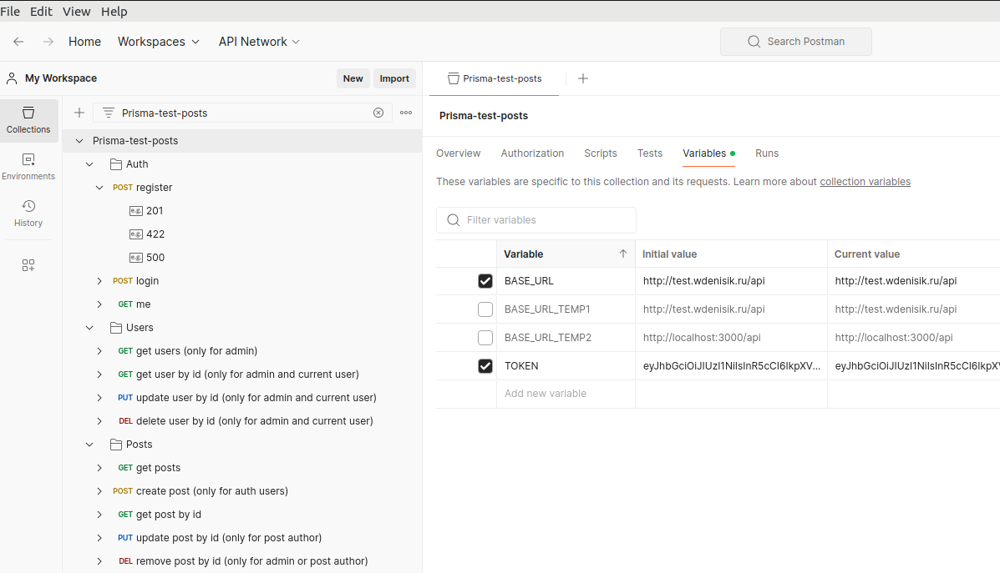

# Description

NestJS 10 API project

### 1. Requirements

Before starting, make sure you have at least those components on your workstation:

- An up-to-date release of NodeJS such as 20.x and NPM
- A locally installed PostgreSQL database such as 14.x

### 2. PostgreSQL configuration

Start by setting the configuration database for the application.
Log into the PostgreSQL prompt:

```sh
sudo -u postgres psql
```

If you are logged in as the postgres account, you can create a new db and role by running the following two commands:

```sh
CREATE DATABASE testsagtech;
CREATE USER testsagtech WITH SUPERUSER PASSWORD 'testsagtech';
```

### 3. Project configuration

Clone this project on your workstation

```sh
git clone git@github.com:Vadzimka0/test-nest-prisma.git
```

The next thing will be to install all the dependencies of the project.

```sh
cd ./test-nest-prisma
npm install
```

Once the dependencies are installed, you can now configure your project by creating a new `.env` file containing the environment variables used for development and running.

```
cp .env.example .env
cat .env
```

Check the `DATABASE_URL` according to your own database setup.
Define a `JWT_ACCESS_TOKEN_SECRET` and `JWT_ACCESS_TOKEN_EXPIRATION_TIME` to sign the JWT tokens

### 4. Launch and discover

You are now ready to launch the NestJS application using the command below.

```sh
# For use in development environments only, performs a Prisma migration
npx prisma migrate dev

# Run seeds fake data
npx prisma db seed

# Launch the watch mode
npm run start:dev

# Launch production mode
npm run build
npm run start:prod
```

Now you can access to the project locally on url [http://localhost:3000/api]('http://localhost:3000/api').

You can now dowload the `Prisma-test-posts_v0.0.1.postman_collection.json` from root folder and import it into the Postman.

Also, project deployed on remote server and available on url [http://test.wdenisik.ru/api]('http://test.wdenisik.ru/api')



### 5. Testing

```bash
# unit tests
$ npm run test

# test coverage
$ npm run test:cov
```

## Stay in touch

- Author - [Vadzim Dzianisik](https://www.linkedin.com/in/vadzim-dzianisik/)
